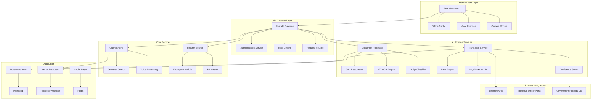
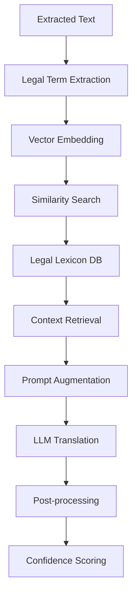

# Design Document: Sutra-Anuvaad AI Land Record System

## Overview

Sutra-Anuvaad is a sophisticated AI-powered system designed to digitize, translate, and make searchable historical land records written in extinct Indian scripts. The system employs a multi-stage AI pipeline combining computer vision, natural language processing, and retrieval-augmented generation to transform deteriorated 70-year-old documents into legally-verifiable modern translations.

The architecture follows a microservices pattern with offline-first mobile clients, ensuring accessibility in rural areas with limited connectivity. The system prioritizes accuracy, transparency, and legal compliance through confidence scoring, human-in-the-loop verification, and integration with government systems.

## Architecture

### High-Level System Architecture



### AI Pipeline Architecture

```mermaid
graph LR
    subgraph "Stage 1: Image Preprocessing"
        A[Raw Document Image] --> B[Quality Assessment]
        B --> C[GAN-based Restoration]
        C --> D[Noise Reduction]
        D --> E[Contrast Enhancement]
    end
    
    subgraph "Stage 2: Script Recognition"
        E --> F[Script Classifier CNN]
        F --> G[Region Segmentation]
        G --> H[ViT OCR Engine]
        H --> I[Character Confidence Scoring]
    end
    
    subgraph "Stage 3: Text Processing"
        I --> J[Unicode Conversion]
        J --> K[Text Normalization]
        K --> L[Language Detection]
    end
    
    subgraph "Stage 4: Translation Pipeline"
        L --> M[Legal Term Extraction]
        M --> N[RAG Retrieval]
        N --> O[Context Augmentation]
        O --> P[LLM Translation]
        P --> Q[Post-processing]
    end
    
    subgraph "Stage 5: Validation"
        Q --> R[Cross-verification]
        R --> S[Confidence Assessment]
        S --> T[Human Review Queue]
        S --> U[Final Output]
    end
```



## Components and Interfaces

### 1. Document Processor Service

**Purpose**: Handles image restoration and optical character recognition for extinct scripts.

**Key Components**:
- **GAN Restoration Module**: Removes visual artifacts using trained generative models
- **ViT OCR Engine**: Vision Transformer-based character recognition for cursive scripts
- **Script Classifier**: CNN-based classifier to identify Modi, Kaithi, Old Urdu scripts
- **Quality Assessor**: Evaluates image quality and processing confidence

**Interfaces**:
```typescript
interface DocumentProcessor {
  processDocument(image: Buffer, metadata: DocumentMetadata): Promise<ProcessingResult>
  assessQuality(image: Buffer): Promise<QualityScore>
  restoreImage(image: Buffer): Promise<RestoredImage>
  extractText(image: Buffer, scriptType: ScriptType): Promise<ExtractedText>
}

interface ProcessingResult {
  extractedText: string
  confidence: number
  scriptType: ScriptType
  processingStages: ProcessingStage[]
  qualityMetrics: QualityMetrics
}
```

### 2. Translation Service with RAG Engine

**Purpose**: Converts archaic legal terminology to modern language using retrieval-augmented generation.

**Key Components**:
- **Legal Lexicon Database**: Curated mappings of historical to modern legal terms
- **RAG Retrieval System**: Vector-based search for contextually relevant translations
- **LLM Translation Engine**: Fine-tuned language model for legal document translation
- **Context Augmentation**: Enriches translation with historical and legal context

**RAG Pipeline Architecture**:


**Interfaces**:
```typescript
interface TranslationService {
  translateDocument(text: ExtractedText, context: DocumentContext): Promise<TranslationResult>
  retrieveContext(terms: LegalTerm[]): Promise<ContextualInformation>
  scoreConfidence(translation: string, original: string): Promise<ConfidenceScore>
}

interface RAGEngine {
  embedText(text: string): Promise<Vector>
  retrieveRelevant(query: Vector, topK: number): Promise<RetrievalResult[]>
  augmentPrompt(query: string, context: RetrievalResult[]): Promise<string>
}
```

### 3. Query Engine Service

**Purpose**: Enables natural language querying of processed documents through voice and text.

**Key Components**:
- **Speech-to-Text Module**: Converts voice queries in local dialects
- **Semantic Search Engine**: Vector-based document search
- **Query Understanding**: NLP pipeline for intent recognition
- **Response Generation**: Contextual answer generation with document highlighting

**Interfaces**:
```typescript
interface QueryEngine {
  processVoiceQuery(audio: Buffer, language: Language): Promise<QueryResult>
  searchDocument(query: string, documentId: string): Promise<SearchResult[]>
  generateResponse(query: string, context: DocumentSection[]): Promise<QueryResponse>
}

interface QueryResponse {
  answer: string
  relevantSections: DocumentSection[]
  confidence: number
  audioResponse?: Buffer
}
```

### 4. Security and Privacy Module

**Purpose**: Ensures data protection, PII masking, and secure document handling.

**Key Components**:
- **Encryption Service**: AES-256 encryption for document storage
- **PII Detection and Masking**: Automated identification and redaction of sensitive information
- **Access Control**: Role-based permissions and audit logging
- **Watermarking**: Digital watermarks for AI-generated content

**Interfaces**:
```typescript
interface SecurityService {
  encryptDocument(document: Document, userKey: string): Promise<EncryptedDocument>
  maskPII(text: string): Promise<MaskedText>
  generateWatermark(content: string, metadata: WatermarkMetadata): Promise<WatermarkedContent>
  auditAccess(userId: string, action: string, resourceId: string): Promise<void>
}
```

## Data Models

### Core Document Model
```typescript
interface LandDocument {
  id: string
  userId: string
  originalImage: EncryptedBuffer
  restoredImage?: ProcessedImage
  extractedText: ExtractedText
  translation: TranslationResult
  metadata: DocumentMetadata
  processingHistory: ProcessingStage[]
  createdAt: Date
  updatedAt: Date
}

interface ExtractedText {
  content: string
  scriptType: ScriptType
  confidence: number
  segments: TextSegment[]
  boundingBoxes: BoundingBox[]
}

interface TranslationResult {
  modernText: string
  confidence: number
  legalTermMappings: LegalTermMapping[]
  uncertainSections: UncertainSection[]
  verificationStatus: VerificationStatus
  certificationInfo?: CertificationInfo
}
```

### Legal Lexicon Model
```typescript
interface LegalTerm {
  historicalTerm: string
  modernEquivalent: string
  context: string
  region: string
  timeperiod: string
  confidence: number
  sources: string[]
}

interface LandMeasurement {
  historicalUnit: string
  modernUnit: string
  conversionRatio: number
  region: string
  standardization: string
}
```

### User and Access Model
```typescript
interface User {
  id: string
  phoneNumber: string
  preferredLanguage: Language
  cscLocation?: string
  accessLevel: AccessLevel
  documentQuota: number
  usageHistory: UsageRecord[]
}

interface RevenueOfficer {
  id: string
  name: string
  jurisdiction: string
  certificationLevel: string
  digitalSignature: string
  verificationHistory: VerificationRecord[]
}
```

## Correctness Properties

*A property is a characteristic or behavior that should hold true across all valid executions of a system—essentially, a formal statement about what the system should do. Properties serve as the bridge between human-readable specifications and machine-verifiable correctness guarantees.*

Before defining the correctness properties, I need to analyze the acceptance criteria from the requirements to determine which ones are testable as properties, examples, or edge cases.

### Document Processing Properties

**Property 1: File Format and Size Validation**
*For any* uploaded file, the system should accept it if and only if it's in a supported format (JPEG, PNG, PDF) and under 10MB in size
**Validates: Requirements 1.1**

**Property 2: Image Quality Improvement**
*For any* document image processed through GAN restoration, the structural similarity index should improve by at least 40%
**Validates: Requirements 1.2, 1.3**

**Property 3: Multi-Page Sequence Preservation**
*For any* multi-page document upload, the processed pages should maintain the same sequence as the original input
**Validates: Requirements 1.5**

**Property 4: Script Recognition Accuracy**
*For any* document in Modi, Kaithi, or Old Urdu script, the OCR system should achieve at least 85% character recognition accuracy
**Validates: Requirements 2.1, 2.2, 2.3**

**Property 5: Mixed Script Handling**
*For any* document containing multiple scripts, each script section should be correctly identified and processed with its appropriate OCR model
**Validates: Requirements 2.4**

**Property 6: Unicode Output Consistency**
*For any* recognized text output, it should be in valid Unicode format and preserve the original script structure
**Validates: Requirements 2.6**

### Translation Engine Properties

**Property 7: Legal Term Mapping Consistency**
*For any* revenue terminology in the input text, the translation should use mappings from the Indian Revenue Lexicon database
**Validates: Requirements 3.1**

**Property 8: Unit Conversion Accuracy**
*For any* historical land measurement unit (bigha, katha, dhur), the translation should apply the correct conversion ratio to modern equivalents
**Validates: Requirements 3.2**

**Property 9: Ambiguous Term Handling**
*For any* ambiguous legal term, the system should provide multiple interpretation options with confidence scores
**Validates: Requirements 3.3**

**Property 10: Document-Wide Terminology Consistency**
*For any* legal term appearing multiple times in a document, it should be translated consistently throughout
**Validates: Requirements 3.4**

**Property 11: Structure Preservation**
*For any* translated document, the output should preserve the original legal document structure and formatting
**Validates: Requirements 3.6**

### Confidence and Verification Properties

**Property 12: Confidence Threshold Enforcement**
*For any* text segment or translation with confidence below specified thresholds (70% for OCR, 80% for translation), the system should flag it for human review or require officer verification
**Validates: Requirements 2.5, 3.5, 8.2**

**Property 13: Confidence Score Calculation**
*For any* translated segment, the system should calculate and display a confidence score between 0 and 100
**Validates: Requirements 8.1**

**Property 14: Cross-Verification Consistency**
*For any* extracted dates and survey numbers, the system should compare them with government records and flag inconsistencies
**Validates: Requirements 8.4**

**Property 15: Hallucination Detection**
*For any* document translation, the system should flag potential hallucinations by checking consistency across document sections
**Validates: Requirements 8.3**

### User Interface Properties

**Property 16: Bidirectional Text Mapping**
*For any* user interaction with translated or original text, tapping should highlight the corresponding section in the other pane
**Validates: Requirements 4.2, 4.3**

**Property 17: Zoom Functionality**
*For any* document view, the zoom feature should support magnification from 1x to 5x
**Validates: Requirements 4.4**

**Property 18: Confidence Color Coding**
*For any* displayed translation, confidence indicators should use correct color coding (green >90%, yellow 70-90%, red <70%)
**Validates: Requirements 4.6**

### Voice and Query Properties

**Property 19: Multi-Language Speech Processing**
*For any* voice input in Hindi, Marathi, or Urdu dialects, the system should correctly process speech-to-text and text-to-speech
**Validates: Requirements 5.1, 11.1**

**Property 20: Playback Speed Control**
*For any* audio playback, the system should support speed adjustment from 0.5x to 2x normal speed
**Validates: Requirements 5.3**

**Property 21: Semantic Query Processing**
*For any* voice query about document content, the system should perform semantic search and highlight relevant document sections
**Validates: Requirements 11.2, 11.3**

**Property 22: Query Result Ranking**
*For any* query with multiple relevant results, the system should present them ordered by relevance with confidence scores
**Validates: Requirements 11.4**

**Property 23: Common Query Pattern Recognition**
*For any* query following patterns like "Is [name] mentioned?" or "Where is survey number [X]?", the system should handle them appropriately
**Validates: Requirements 11.6**

### Security and Privacy Properties

**Property 24: Comprehensive Data Encryption**
*For any* uploaded document, it should be encrypted using AES-256 and stored with user-specific access keys
**Validates: Requirements 6.1, 6.3**

**Property 25: PII Masking**
*For any* document containing personally identifiable information, the system should automatically detect and mask names, addresses, and ID numbers
**Validates: Requirements 6.2**

**Property 26: Watermarking and Disclaimers**
*For any* shared translation result, it should include watermarks indicating AI-generated content and disclaimer text
**Validates: Requirements 6.4, 8.5**

**Property 27: Automatic Data Cleanup**
*For any* processed document not explicitly saved by the user, it should be automatically deleted after 30 days
**Validates: Requirements 6.5**

**Property 28: Comprehensive Audit Logging**
*For any* system access, confidence assessment, or human intervention, it should be logged with timestamp and user identification
**Validates: Requirements 6.6, 8.6**

### Offline and Performance Properties

**Property 29: Low-Bandwidth Functionality**
*For any* network connection with <100kbps bandwidth, the system should maintain basic OCR capabilities
**Validates: Requirements 7.1**

**Property 30: Offline Caching**
*For any* essential translation dictionary, it should be cached locally and available offline after initial setup
**Validates: Requirements 7.2, 5.5**

**Property 31: Queue Management**
*For any* document upload during offline periods, it should be queued and processed when connectivity is restored
**Validates: Requirements 7.3**

**Property 32: Data Compression**
*For any* data transfer, the system should achieve at least 60% compression to minimize bandwidth usage
**Validates: Requirements 7.5**

### Government Integration Properties

**Property 33: Officer Certification Process**
*For any* officer-certified translation, the system should generate a digitally signed verification certificate
**Validates: Requirements 9.2**

**Property 34: Jurisdiction-Based Routing**
*For any* low-confidence translation requiring review, it should be routed to the appropriate Revenue Officer based on jurisdiction
**Validates: Requirements 9.4**

**Property 35: API Integration**
*For any* language processing task, the system should utilize Bhashini APIs when available
**Validates: Requirements 12.1**

**Property 36: System Compatibility**
*For any* generated output, it should be compatible with existing Revenue Department systems and NGDRS integration requirements
**Validates: Requirements 12.3, 12.4**

### Business Logic Properties

**Property 37: Usage Quota Management**
*For any* user, the system should enforce free usage limits of 5 pages per month and charge premium fees for certified translations
**Validates: Requirements 10.1, 10.2**

**Property 38: Concurrent Processing Capacity**
*For any* peak hour period, the system should handle up to 1000 concurrent document processing requests
**Validates: Requirements 10.4**

**Property 39: Multi-Tenant Deployment**
*For any* CSC deployment, the system should support centralized management across 500 locations with proper tenant isolation
**Validates: Requirements 10.3**

## Error Handling

### Image Processing Errors
- **Poor Quality Images**: When image quality assessment falls below acceptable thresholds, the system provides specific improvement suggestions (better lighting, higher resolution, cleaner background)
- **Unsupported Formats**: Graceful rejection of unsupported file formats with clear error messages
- **Size Limit Violations**: Clear feedback when files exceed 10MB limit with compression suggestions

### OCR and Translation Errors
- **Low Confidence Recognition**: Automatic flagging and routing to human reviewers when OCR confidence falls below 70%
- **Script Misidentification**: Fallback mechanisms when script classifier fails, including manual script selection options
- **Translation Ambiguity**: Multiple interpretation options presented with confidence scores for ambiguous terms

### Network and Connectivity Errors
- **Offline Mode Degradation**: Graceful degradation to cached functionality when network is unavailable
- **Bandwidth Limitations**: Automatic quality adjustment and compression based on available bandwidth
- **Sync Failures**: Retry mechanisms with exponential backoff for failed synchronization attempts

### Security and Access Errors
- **Authentication Failures**: Clear error messages for invalid credentials with account recovery options
- **Authorization Violations**: Proper access denied messages without revealing system internals
- **Encryption Errors**: Secure error handling that doesn't expose encryption keys or sensitive data

## Testing Strategy

### Dual Testing Approach

The system employs both unit testing and property-based testing to ensure comprehensive coverage:

**Unit Tests** focus on:
- Specific examples of document processing workflows
- Integration points between AI pipeline components
- Edge cases like extremely poor image quality or corrupted files
- Error conditions and exception handling
- Government API integration scenarios

**Property-Based Tests** focus on:
- Universal properties that hold across all valid inputs
- Comprehensive input coverage through randomization
- Correctness guarantees for the AI pipeline
- Security and privacy invariants
- Performance characteristics under various conditions

### Property-Based Testing Configuration

**Testing Framework**: We will use Hypothesis (Python) for property-based testing with the following configuration:
- Minimum 100 iterations per property test to ensure statistical significance
- Each property test references its corresponding design document property
- Tag format: **Feature: sutra-anuvaad, Property {number}: {property_text}**

**Test Data Generation**:
- Synthetic document images with controlled noise patterns
- Historical script samples from digitized archives
- Legal terminology corpus from Indian Revenue records
- Multi-language voice samples for speech processing tests
- Network condition simulations for offline testing

**Coverage Requirements**:
- Each correctness property must be implemented by exactly one property-based test
- Unit tests should achieve 90% code coverage for critical path components
- Integration tests should cover all external API interactions
- Performance tests should validate scalability requirements under load

### Test Environment Setup

**AI Model Testing**:
- Separate test datasets for each script type (Modi, Kaithi, Old Urdu)
- Ground truth annotations for accuracy measurement
- Controlled image degradation for restoration testing
- Legal terminology validation datasets

**Security Testing**:
- Penetration testing for encryption and access controls
- PII detection accuracy testing with synthetic sensitive data
- Audit log integrity verification
- Watermark tamper resistance testing

**Performance Testing**:
- Load testing with 1000 concurrent users
- Network simulation for 2G/3G conditions
- Memory usage profiling for mobile devices
- Battery consumption optimization testing